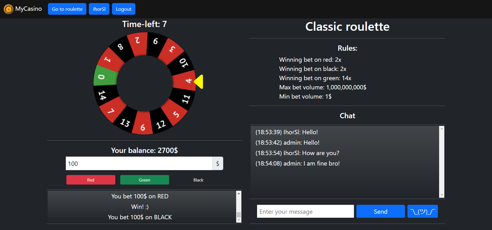
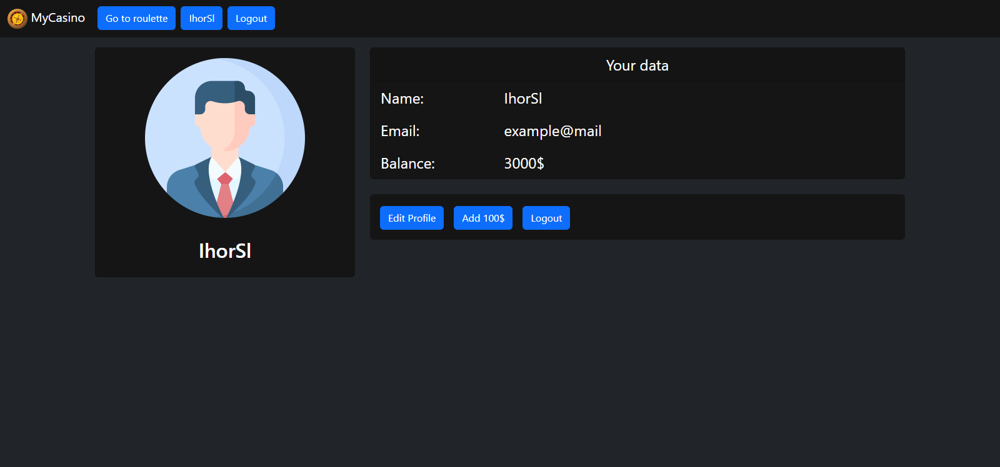
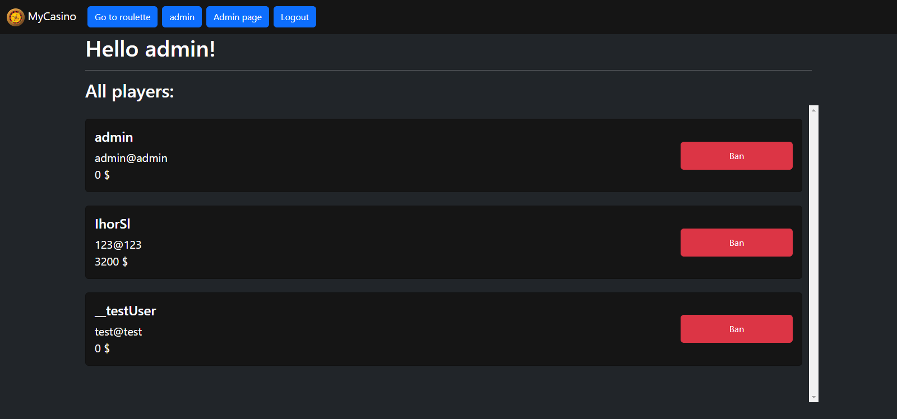

# MyCasino-pet-project
I created my own pet-project casino to practice my Java (Spring) skills.
___
## Technologies
* Spring framework :leaves:
    * :clipboard: MVC (thymeleaf)
    * :lock: Security
    * :books: Data, Validation
    * :speech_balloon: WebSockets
    * :elephant: PostgreSQL
* HTML, CSS (Bootstrap), JavaScript
* Testing:
    * :test_tube: JUnit
    * :cocktail: Mockito
## Possibilities
* :gear: Create, edit, manage player account
* :moneybag: Make bets by playing roulette
* :speech_balloon: Chat (WebSockets)
* :robot: Admin role: special admin page where you can **ban** players
## Screenshots

